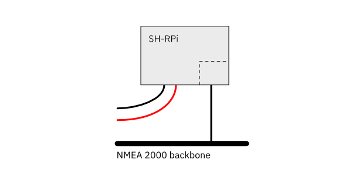
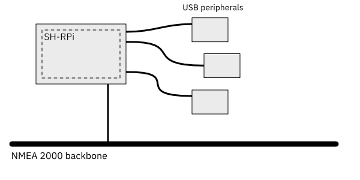

# Powering via NMEA 2000

It is possible to power the Raspberry Pi via the NMEA 2000 network. To stay compliant with the NMEA 2000 specification and to ensure safe and uninterrupted operation of the NMEA 2000 network, it is important to observe some restrictions in the device connections.

The following diagrams illustrate the valid powering schemes.
In the diagrams, dashed lines illustrate the isolation barrier

\\
*Always OK: SH-RPi powered with a dedicated power cable.*

\\
*OK: SH-RPi powered via the NMEA 2000 network, no external connections.*

\\
*OK: SH-RPi powered with a dedicated power cable and connected to external devices with a galvanic connection such as USB or unisolated RS-422.*

\\
*OK: SH-RPi powered via the NMEA 2000 network and connected to external devices with an isolated connection such as Ethernet or isolated NMEA 0183.*

\\
*OK: SH-RPi powered via the NMEA 2000 network having peripherals such as keyboard, mouse, or a GPS receiver that are powered by the Raspberry Pi and not connected elsewhere.*

\\
*Not permitted: SH-RPi powered via the NMEA 2000 and connected to external devices with a galvanic connection. This setup will cause a lot of noise and may impact the reliability of the Raspberry Pi or other devices.*
