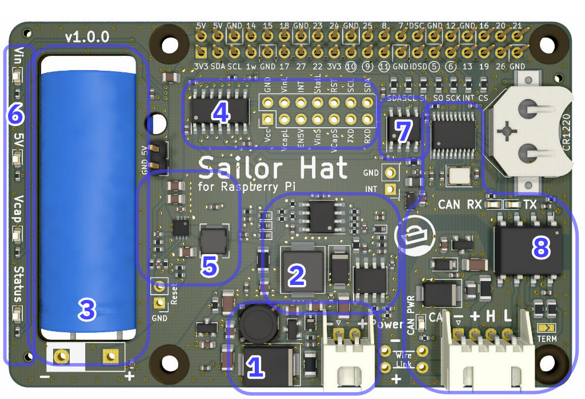
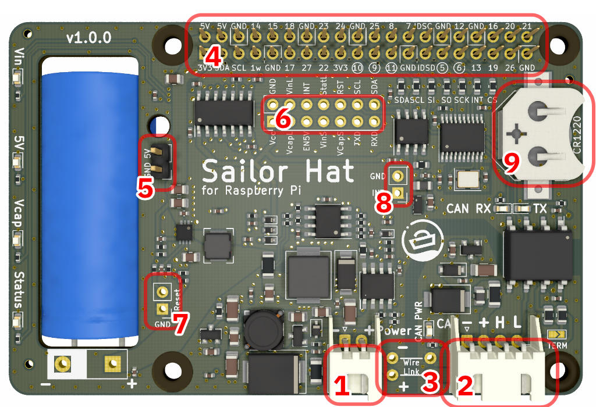
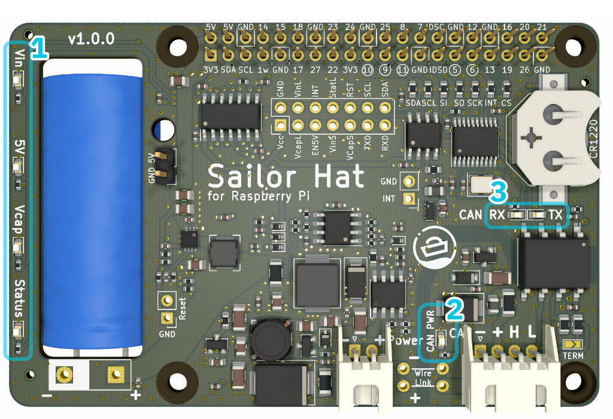
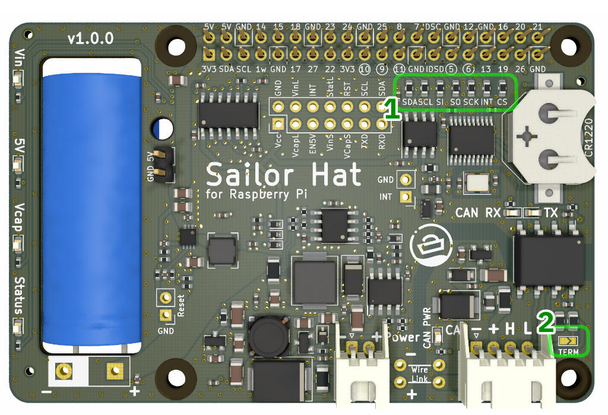

# Hardware description
{: .no_toc }

## Table of contents
{: .no_toc .text-delta }

1. TOC
{:toc}

## Tour around the board

Different functional blocks of the Sailor Hat for Raspberry Pi are described below.

{:width="50%"}\\
*Functional blocks of the SH-RPi.*

1.  Power input and protection. 
    Power input is provided through a 2-pin JST XH connector.
    The permitted voltage range is 8-32V.
    The protection circuitry at power input includes:
    - 2.5A SMD fuse
    - 33V transient voltage suppressor (5000W peak pulse power capability)
    - Pre-filter for conducted electromagnetic interference
    - Reverse polarity protection
2.  Step-down (buck) converter with current limiting.
    The buck converter transforms the input voltage into a 2.65V potential that the supercapacitor can handle.
    The step-down converter circuit also includes a separate current limiter that throttles the supercapacitor input current to cap the maximum device current draw to 0.8A (at 12V).
3.  A 60F 2.7V supercapacitor.
    The supercapacitor acts as a power reservoir for the Raspberry Pi.
    It can power a Raspberry Pi 4B for up to 40 seconds, and lower-power models for much longer.
    The supercapacitor also makes it possible to power the Raspberry Pi using a low-power interface such as the NMEA 2000 bus that limits an individual node current to 1.0A, including high-speed transients.
4.  Microcontroller.
    The SH-RPi operations are controlled by an ATtiny1614 microcontroller.
    The microcontroller performs the following functions:
    - Measures the input voltage
    - Measures the supercapacitor voltage
    - Controls the Vin, Vcap, and Status leds
    - Controls the boost converter output
    - Receives real-time clock interrupt information (can be used as an external interrupt source as well)
    - Communicates the SH-RPi status the the Raspberry Pi service over I2C
5.  Step-up (boost) converter.
    The boost converter converts the 0.5-2.65V potential stored in the supercapacitor into the 5V Raspberry Pi input voltage.
    The boost converter operation is controlled by the microcontroller. The microcontroller enables the boost converter when the supercapacitor voltage has risen above 1.5V (FIXME: check!).
    During system shutdown or watchdog reboot, the microcontroller disables the boost converter to cut the Raspberry Pi input voltage.
6.  Status LEDs.
    The status LEDs indicate the board operational status LEDs as described in Section [LEDs](#sec_leds).
7.  Real-time clock (optional).
    The board includes an optional DS3231MZ real-time clock that can keep accurate time even in absence of internet or GPS connectivity.
    The RTC communicates with the Raspberry Pi over I2C.
8.  CAN bus (NMEA 2000) interface.
    The SH-RPi includes an MCP2515 CAN controller and an ISO1050DUB CAN transceiver that provide an isolated, NMEA 2000 compliant CAN bus interface. The interface can be used as a generic CAN interface if external power is provided to the CAN connector.

## Connectors

{:width="50%"}\\
*SH-RPi connectors.*

## Power supply

- input specs
- output specs

## Peripherals

### LEDs

{:width="50%"}\\
*SH-RPi indicator LEDs.*

### CAN bus (NMEA 2000)

NMEA 2000 is a ubiquitous communications standard used for connecting sensor, control, and display devices on boats and ships.
It is based on the Controller Area Network (CAN bus) which is a vehicle bus standard designed to allow devices to communicate with each other without a host computer.

SH-RPi includes an isolated CAN bus interface that allows safe and NMEA 2000 compliant interconnection of devices.

TODO

### I2C

I2C (Inter-Integrated Circuit) is a very popular synchronous serial communication bus commonly used for interfacing with a number of different ICs.
It uses two data wires in addition to voltage and ground.

TODO

### Real-time clock backup battery

### GPIO header

### Other headers

## Remapping peripherals

{:width="50%"}\\
*SH-RPi hardware jumpers.*
