# OpenPlotter Server Installation
{: .no_toc }

## Table of contents
{: .no_toc .text-delta }

1. TOC
{:toc}

---

## Introduction

In this tutorial we'll build an OpenPlotter server using the [Sailor Hat for Raspberry Pi](https://hatlabs.github.io/sh-rpi/) ([purchasing link](https://hatlabs.fi/product/sh-rpi-enclosure-kit/)) and the OpenPlotter software.
The server is compact and waterproof and powered easily through the boat's 12/24V power system.
It also integrates easily with your existing boat electronics.

The included software will log all essential NMEA 2000 traffic on the boat and allows you to visualize the real-time and historical behavior of different values using integrated instrument panels as well as Grafana dashboards.
Furthermore, the server can receive and process information from other sources such as [SH-ESP32 sensor devices](https://hatlabs.github.io/sh-esp32/) or from various Internet services.

Some visualization examples:

[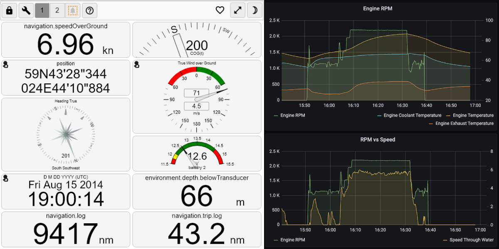](assets/screenshots/001_examples.jpg)

## Parts needed

To complete this tutorial, you need the following parts:

- [SH-RPi enclosure kit](https://hatlabs.fi/product/sh-rpi-enclosure-kit/)

  SH-RPi is the secret sauce that provides the required hardware interfaces to your boat's subsystems for the Raspberry Pi. It includes an integrated, protected 12/24V power supply with safe shutdown functionality as well as an isolated NMEA 2000 compatible CAN interface.

  In this tutorial we'll use the plastic enclosure and power the Pi through an NMEA 2000 panel connector. Additionally, a USB type A panel connector is used to provide easier connectivity when needed, and a cooling fan is added to improve heat dissipation. Feel free to modify your own configuration, though.

  We'll also use an additional USB WiFi adapter because that will make things easier during the installation (the additional network interface may come handy on the boat as well). If you don't want the USB WiFi adapter, you can alternatively plug the Pi into wired Ethernet for equivalent results.
  
- A Raspberry Pi 4B

  A 4 GB memory model is fine. Amazon tends to have unbeatable prices, or you can check the list of distributors on the Raspberry Pi website:

    * [amazon.com](https://www.amazon.com/Raspberry-Model-2019-Quad-Bluetooth/dp/B07TC2BK1X/)
    * [amazon.de](https://www.amazon.de/-/en/Raspberry-ARM-Cortex-A72-WLAN-ac-Bluetooth-Micro-HDMI-Single/dp/B07TC2BK1X/)
    * [amazon.co.uk](https://www.amazon.co.uk/Raspberry-Pi-ARM-Cortex-A72-Bluetooth-Micro-HDMI/dp/B07TC2BK1X/)
    * [Raspberry Pi list of distributors](https://www.raspberrypi.org/products/raspberry-pi-4-model-b/?variant=raspberry-pi-4-model-b-4gb)

- MicroSD memory card

  A MicroSD card hosts the Raspberry Pi operating system and data files. I have had good results with Samsung Evo Plus cards. Memory cards are cheap and bigger ones are more reliable in Raspberry Pi use, so get at least a 64 GB one:

  * [amazon.com](https://www.amazon.com/Samsung-MicroSDXC-Memory-Adapter-MB-MC64GA/dp/B06XFWPXYD/)
  * [amazon.de](https://www.amazon.de/-/en/Samsung-Flash-Memory-MicroSDXC-Class/dp/B08BKCB4JW/)
  * [amazon.co.uk](https://www.amazon.co.uk/Samsung-MicroSDXC-Class-UHS-I-Memory/dp/B08BKCB4JW/)

- Double-sided tape or hot glue

  A short piece of double-sided tape or a dab of hot glue is needed for mounting the cooling fan.

- Heat shrink tube, 3 mm inner diameter

  While not absolutely necessary, some 3 mm i.d. heat shrink tube is useful to secure the soldered panel connector wires.

- [NMEA 2000 female plug](https://hatlabs.fi/product/nmea-2000-cable-plug/)

  If you're doing the initial installation at home, having an extra NMEA 2000 micro plug comes handy for providing input voltage to the device.

## Hardware assembly

### Drilling holes for the connectors

As always when drilling holes to a perfectly good enclosure, plan very carefully ahead. The panel connectors take surprisingly lot of space and a hole can't be easily patched, let alone moved.

My preference is to take measurements of the enclosure and create a drilling template in a vector drawing program. A drawing helps you observe the maximum dimensions required by the connector and the nut.

If you have no idea what program to use, [Inkscape](https://inkscape.org) is a good all-around tool. If you're more technically inclined, CAD software such as [LibreCAD](https://librecad.org) might work as well.

I wanted to have three holes at the short edge of the plastic enclosure. Here's the template I did for that:

[{:width="50%"}](assets/plastic-enclosure-end-template.svg)

The [template](assets/plastic-enclosure-end-template.svg) is an SVG (vector) file, so you can save it and modify according to your liking.
If you don't know which software to use, you can try for example [Inkscape](https://inkscape.org) mentioned above. I personally use Affinity Designer that is a low-cost commercial design software available for MacOS.

If you have trouble opening the SVG, the template is also available as a [PDF version](assets/plastic-enclosure-end-template.pdf).

Once you have finished a template, mark the center point on the enclosure and tape the template to the enclosure so that the center points match.

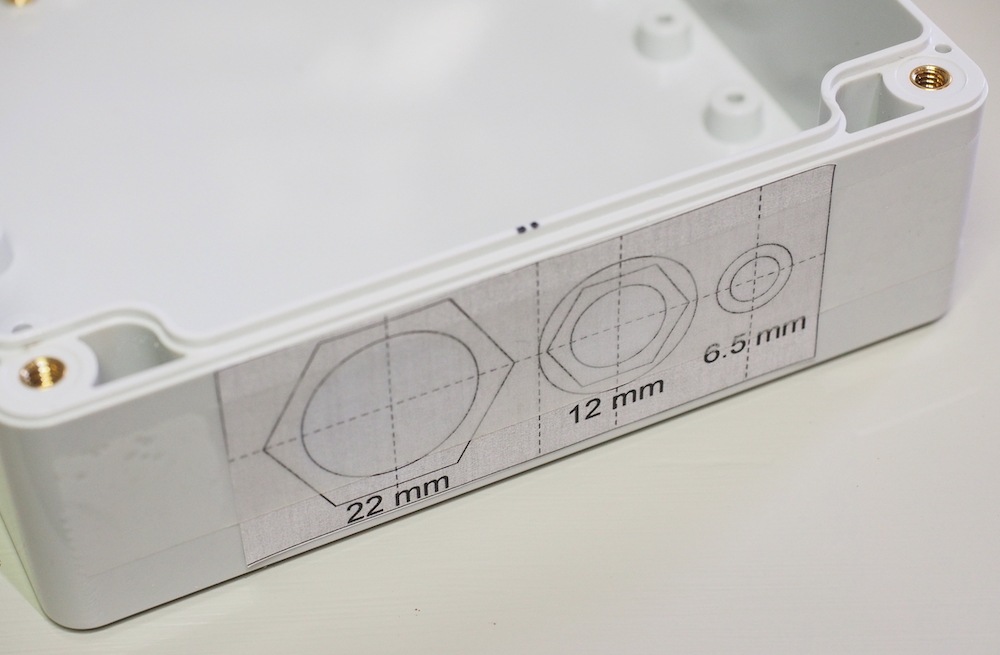{:width="50%"}

For accurate drilling, it helps to mark the hole centers with a center punch (a sharp nail and a light tap with a hammer is also fine). 

Drill pilot holes with a small drill bit (3 mm or so). Then use a step drill bit to drill the final holes. Take your time and use a slow speed. Smaller holes with odd sizes such as the 6.5 mm one should be finished with a corresponding size metal bit.

Drilling plastic leaves a lot of burrs around the holes. Those can be removed with a sharp knife. 

Finally, on the plastic enclosure, the integrated standoffs may block the holes you drilled. I had to remove one of the standoffs. I used a Dremel tool but sturdy pliers might work as well.

Here's what the end result looks like in my case.

{:width="50%"}

### Connecting wires to the NMEA 2000 panel connector

Next, we will solder the JST XH pigtails to the NMEA 2000 panel connector. This same approach also works for soldering the SP13 power connectors if you decide to use one of those instead.
We'll start by filling the connector pin cups with solder.

{:width="50%"}

We want to power both the board itself and the CAN interface using the NMEA 2000 connector. There's more than one way to do that but let's use the obvious method and connect both connector pigtails to the NMEA panel connector.

Peel a short length of the red and black wires and wrap them together.

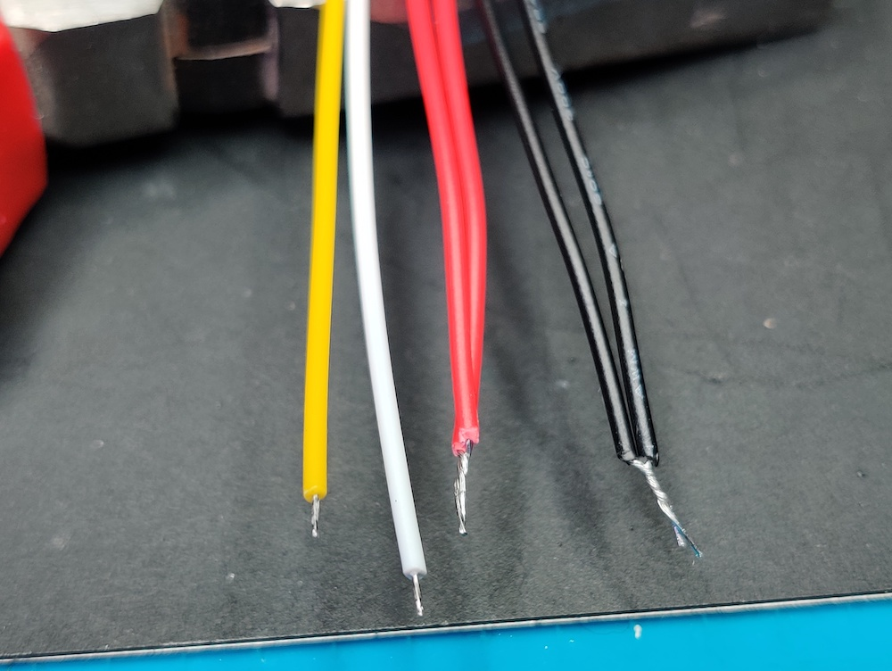{:width="50%"}

It is recommended to use heat shrink tube to isolate the connector pins and to provide mechanical support to the solder joints. Cut short pieces of the heat shrink tube and slide them on the wires. (Guess who forgot this part _again_ while preparing the photos for this tutorial!)

Solder the wires, both the individual signal wires and the spliced together power wires, to the connector.

The diagram below shows the correct pinout. Yes, it's a male connector, but because we're staring at the wrong end of the connector, we'll use the opposite gender diagram. (Yes, it's a bit confusing.)

{:width="50%"}

Start by soldering the middle pin first. It's easier to do now when the other wires are not yet flapping around. The standard color for the CAN_L wire is blue but our harness has yellow instead.

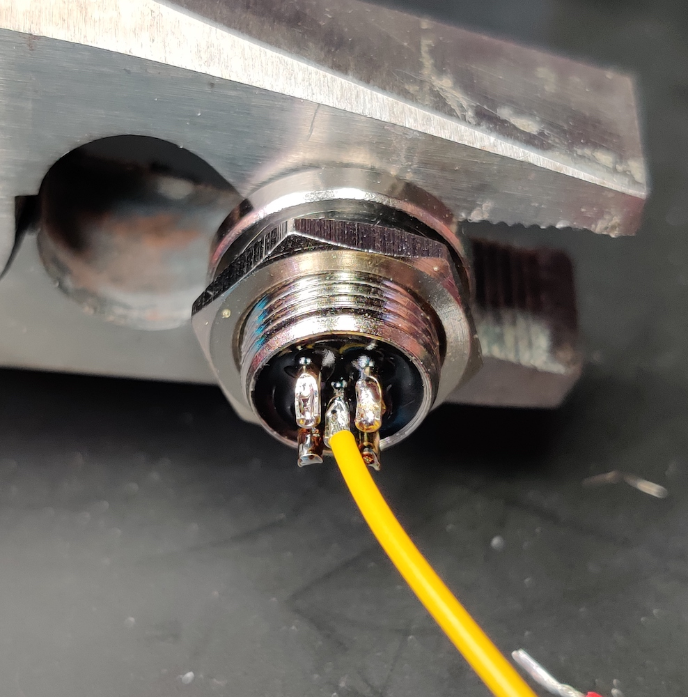{:width="50%"}

Next, solder the three other wires in place. Shield is left unconnected.

This is what your connector should look like at this stage:

{:width="50%"}

I'm boldly assuming you remembered to slide the heat shrink bits in place before soldering the wires. Now it's time to slide them on top of your soldered connections and use a hot air gun (or a lighter flame) to shrink them. The end result should be roughly like this:

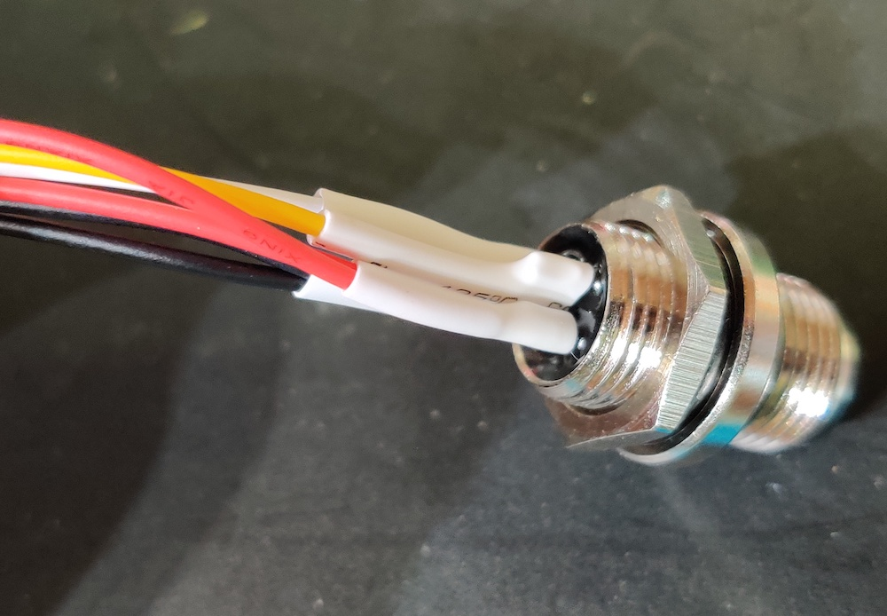{:width="50%"}

Screw the finished NMEA 2000 panel connector onto the enclosure.

Yet another photo of a finished connector and the pinout:

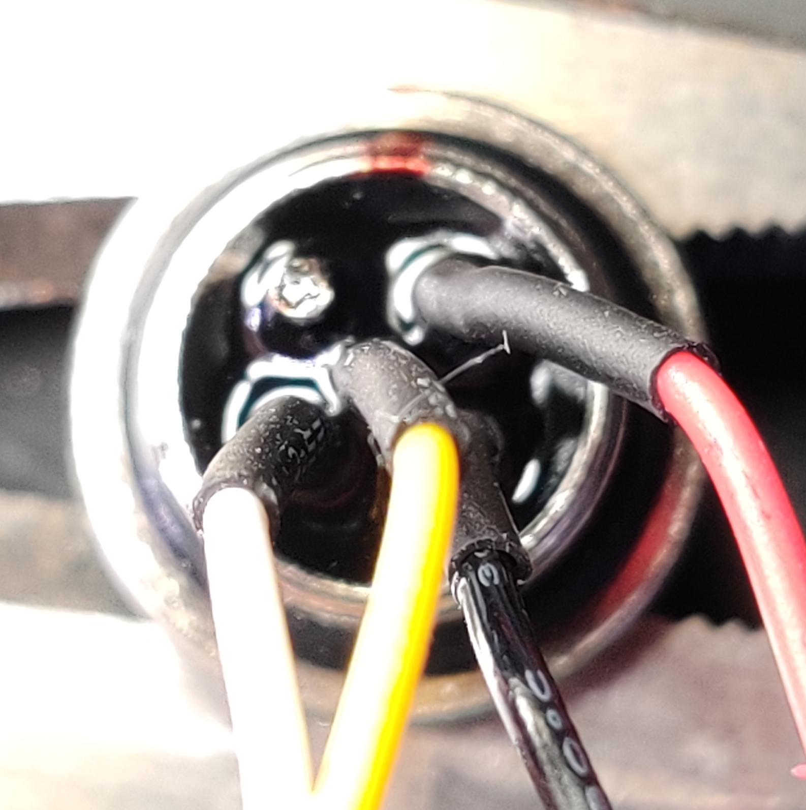{:width="50%"}

### Connecting other panel connectors

Now that the hard part is done, the other connectors can be screwed in place. To improve the watertightness of the WiFi antenna connector, you can add a small O-ring or a gasket around the connector before mounting it.

In the end, this is what you should have:

{:width="50%"}

### SH-RPi Assembly

Now we want to mount the Raspberry Pi in the enclosure.
We're using the plastic enclosure and the mount adapters that should have arrived with the enclosure.

First, we'll attach the short standoffs to the mount adapters with the M2.5 nuts. Try to get them tight.

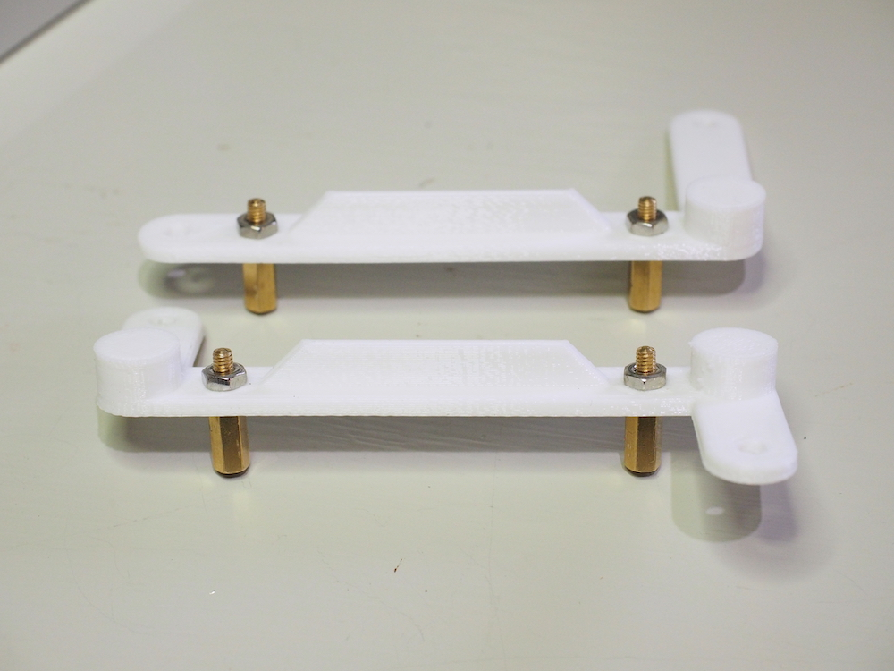{:width="50%"}

Once the standoffs are in place, the adapters themselves can be mounted to the enclosure with the self-tapping screws.

{:width="50%"}

The Raspberry Pi goes on the standoffs. Fix the upper standoffs with the M2.5 screws and the lower ones with two 16mm hex standoffs.

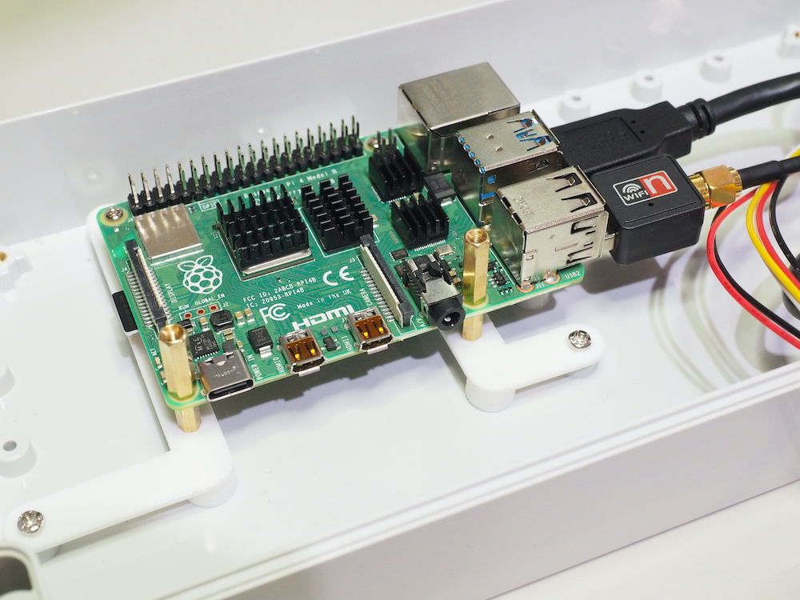{:width="50%"}

The Sailor Hat comes next. Press it on the Raspberry Pi GPIO header. Secure it with two M2.5 screws.

**NB**: Whenever you need to remove the Hat, you might be inclined to wiggle the hat sideways. While this works well, there is also a small risk of bending the Pi header pins at either end of the connector. Instead, wiggle the hat up and down while gently pulling up. It's a bit slower but the hat will pop off with much less risk of bending the pins.

At this point you can also plug in all USB devices and connect the SH-RPi power and CAN cables. If you're using a colling fan, mount it as well. Use two-sided tape or a bit of hot glue to fix it next to the Raspberry Pi, with the sticker side facing the Pi. 

This is what the finished assembly looks like:

{:width="50%"}

Don't close the lid yet. You'll still have to insert the memory card to the Pi.

## Software

In this section, we'll install the OpenPlotter software on the Raspberry Pi. OpenPlotter is a specialized marine software distribution based on the Raspberry Pi OS. It comes in many flavors; in this tutorial, a headless version is used, meaning that no display is directly connected to the Raspberry Pi. For display purposes, web browsers or remote desktop connections are used instead, allowing for more secure placement of the server and screens where you need them.

### Installing OpenPlotter

OpenPlotter is installed by writing a disk image to a MicroSD card and inserting that card into the Raspberry Pi.

First, [download Raspberry Pi Imager](https://www.raspberrypi.org/software/). The Imager is an easy-to-use piece of software that is used to write the downloaded image file to the memory card.

**NOTE:** The Imager is only available for download for macOS, Windows, and Ubuntu Linux. If you are using some other operating system or Linux distribution, you might need to use some other software to flash the card (but at that point, I assume you are well aware of how to do that).

Once downloaded, install the imager.

Next, [download the OpenPlotter image](https://openplotter.readthedocs.io/en/latest/getting_started/downloading.html). I am using the Headless image in this tutorial. If you'd rather connect a display to the Pi, you can also get the Starting image. Once the image has been downloaded, you might have to unzip it for flashing. The disk image is quite big, so you should have a few gigabytes of free space on your drive.

Flash the image the the MicroSD card. First, insert the card in a reader connected to your computer. Many laptops also have integrated SD card readers. To use those, use the SD adapter that you received with the card. Then, open the imager. In the operating system menu, select "Use custom" at the bottom of the list, and then select the downloaded image file.

[{:width="50%"}](assets/screenshots/01_imager.jpg)

Then select the correct MicroSD card with the Storage button. To avoid any costly mistakes, I recommend removing any other pluggable media from your computer. Click Write. You might have to enter your password at this stage to allow Imager to write to the MicroSD card.

[{:width="50%"}](assets/screenshots/02_imager_in_progress.jpg)

Writing and verifying to MicroSD card will take a bit of time. We can use that time to download and install [VNC Viewer](https://www.realvnc.com/en/connect/download/viewer/). VNC Viewer is a remote desktop software that we will use to access OpenPlotter in the following sections.

Once the MicroSD card is done, insert it in the Raspberry Pi MicroSD card slot. You might have to temporarily unplug the hat to do that. (Yeah, sorry, the tutorial isn't 100% consistent.)

Finally, power on the device. While it's possible to plug a 5V USB-C cable in the Raspberry Pi, that will lead you into trouble once you install the SH-RPi daemon software later in this tutorial. So, you should use a 12V power supply (actually, anything between 10-32V goes) and wire it to an NMEA 2000 plug. You can also insert some short female jumper wires directly to the JST XH connectors and use small alligator clips to connect the wires to a power supply. Use your imagination!

### OpenPlotter initial configuration

At this point you should have a device with a lot of blinking lights but no way to communicate with it. Luckily, there is a way. If you look at availabe Wi-Fi networks around you, you should see a network called "openplotter":

[{:width="50%"}](assets/screenshots/03_select_wifi.jpg)

Connect to that network (the password is `12345678`).

Now, you're within the reach of the Pi. To access it, we'll use VNC Viewer we installed previously.

[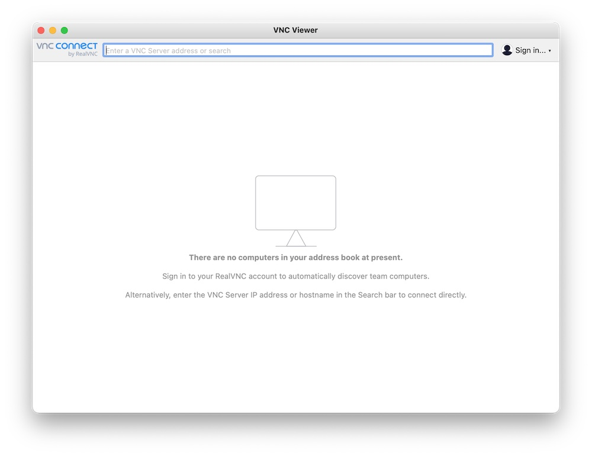{:width="50%"}](assets/screenshots/04_vnc_viewer.jpg)

On startup screen, type `openplotter.local` in the address bar (if that doesn't work, the try entering the IP address `10.10.10.1`). If the server was found, you'll be greeted with an authentication screen:

[{:width="50%"}](assets/screenshots/05_vnc_credentials.jpg)

Enter username `pi` and password `raspberry`.

If everything was successful, you'll be greeted with a pristine OpenPlotter desktop view:

[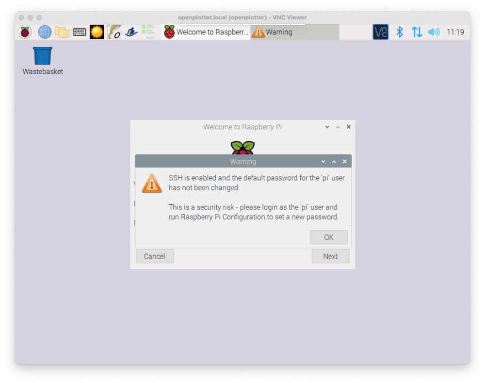{:width="50%"}](assets/screenshots/06_vnc_connected.jpg)

Great! Go through the initial Pi welcome wizard. You'll have to first enter a new password and select the country, language, and other basic settings.

If you have plugged in a compatible USB WiFi dongle, you'll need to select a WiFi network to connect to. This is very handy as it will allow you to connect to the internet to download updates and whatnot.

[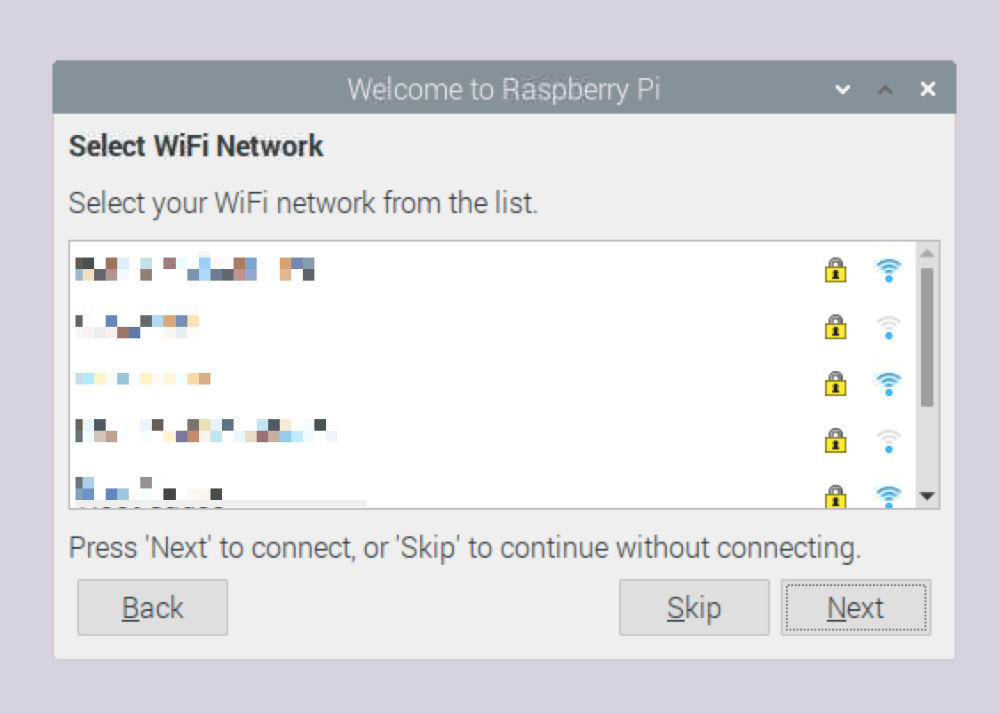{:width="50%"}](assets/screenshots/07_pick_raspi_wifi.jpg)

Note that if you don't have a WiFi adapter plugged in, the initial setup might be a bit different from what's described below.

During the initial setup, the Pi will update the system software. It will take a while, so go get a coffee or play with your spouse/kids/pets.

[{:width="50%"}](assets/screenshots/08_update.jpg)

Once the setup is complete, restart the Pi. You were connected to the Pi's WiFi access point, so your computer's network connection will revert back to your regular WiFi at this point. If you have the USB WiFi adapter and configured the Pi to use the same network, you can still access the Pi using the same `openplotter.local` address. See why I recommended getting the extra WiFI adapter? Otherwise, you'll need to reconnect to the "openplotter" network once it becomes available again.

[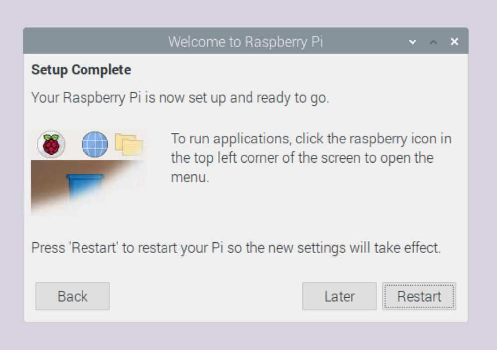{:width="50%"}](assets/screenshots/09_basic_setup_complete.jpg)

Anyway. Get back to VNC Viewer and connect to `openplotter.local`. You changed the `pi` user password during the initial configuration, so you'll need to enter the new password in VNC Viewer.

Once you're back in, we'll modify the network settings on the OpenPlotter installation. From the Raspberry menu, select OpenPlotter -> Network.

(When opening the Network app, the it might complain that it wants to reconfigure your system. Let it do that and reopen the app once it's done.)

[{:width="50%"}](assets/screenshots/11_open_openplotter_network.jpg)

In the network panel, you'll see the available network devices on the left and the access point settings on the right. 

If you don't want to have an access point, select "none" in the left side menu. If you want to keep the AP (and I'd recommend that because that provides you a backup access the Pi), it's important to change the network password:

[{:width="50%"}](assets/screenshots/14_openplotter_network_password.jpg)

The WiFi client settings can be found at the WiFi symbol in the upper right hand corner of the OpenPlotter desktop. That's where you configure additional networks such as your boat's WiFI AP.

[{:width="50%"}](assets/screenshots/16_wifi_client_settings.jpg)

After modifying the network settings, reboot OpenPlotter.

### Installing SH-RPi-daemon

The most urgent things out of the way, it's time for us to install the SH-RPi-daemon. ([Daemons](https://en.wikipedia.org/wiki/Daemon_(computing)#Etymology) are benevolent spirits that serve to help define a person's character or personality. Or in this case, background services for UNIX descendant operating systems.) We could use the VNC Viewer for doing that by opening Accessories -> Terminal from the Raspberry menu, and that is what I recommend Windows users to do, but for Mac and Linux users, I'll show how to access the OpenPlotter device using SSH.

First, we'll do a small digression. Instead of just madly ssh'ing in, we'll first use `ssh-copy-id` to copy our SSH public key to the device. This will allow subsequent logins to be performed without entering a password.

Mac users may have to install `ssh-copy-id` first. It is available via [Homebrew](https://brew.sh/) -- if you haven't installed it yet, do so! It's great! Once you have that, do:

    brew install ssh-copy-id

Linux users, on the other hand, are pampered and have `ssh-copy-id` already preinstalled.

Next, copy the public key:

    ssh-copy-id pi@openplotter.local

And that's it! Now you can login to the Pi without a password. I recommend to use this method on all systems you're accessing remotely -- it's more secure than using passwords.

[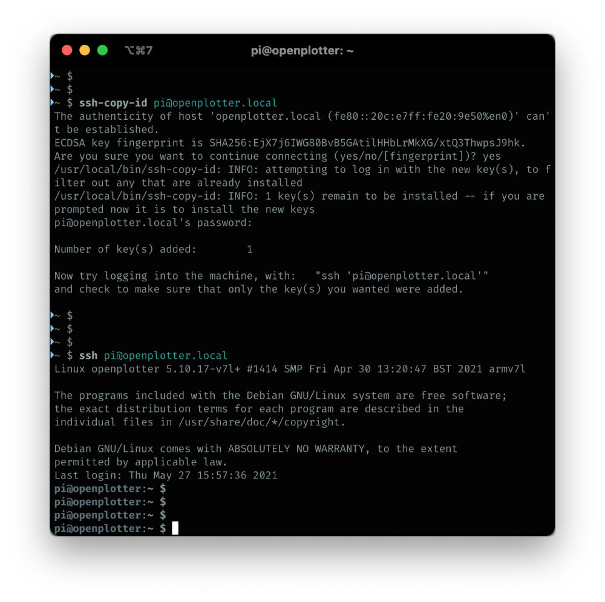{:width="50%"}](assets/screenshots/18_ssh.jpg)

Once you've logged with `ssh pi@openplotter.local`, copy paste the installation command to the command prompt:

    curl -L \
    https://raw.githubusercontent.com/hatlabs/SH-RPi-daemon/main/install.sh \
    | sudo bash

If you have a relatively unmodified system, this command will install the required configuration changes and the daemon software automatically. It should only take a few seconds. All you need to do is to manually reboot once the installation has finished:

    sudo reboot

When rebooting, pay attention to the SH-RPi LEDs. The RX led has been solid green and the Status led solid red, but after rebooting, RX led will flicker happily (assuming there's traffic on the NMEA 2000 bus), and the Status led is red but blinks briefly every second. These changes indicate that the CAN interface and that the daemon watchdog are active. Yay.

When you connect to the VNC after rebooting, you'll see the following message:

[{:width="50%"}](assets/screenshots/20_after_reboot.jpg)

This indicates we now have an active can interface but it isn't configured in [Signal K](https://signalk.org) yet. We'll do that in the next section.

### Configuring Signal K to receive NMEA 2000 traffic

To process the NMEA 2000 data, we need to configure Signal K to receive it. Open the Signal K dashboard at [http://openplotter.local:3000/](http://openplotter.local:3000/).

To do anything with the server, you need to enable security and create an admin user. Click the "Login" button at the top right:

[{:width="50%"}](assets/screenshots/21_sk_server_dashboard.jpg)

You're asked to create a new admin user. I prefer to use `admin` as the username, and then a suitable easy-to-remember, easy-to-type password as the password. This is only accessible from your internal network.

Next, you might want to upgrade the SK server:

[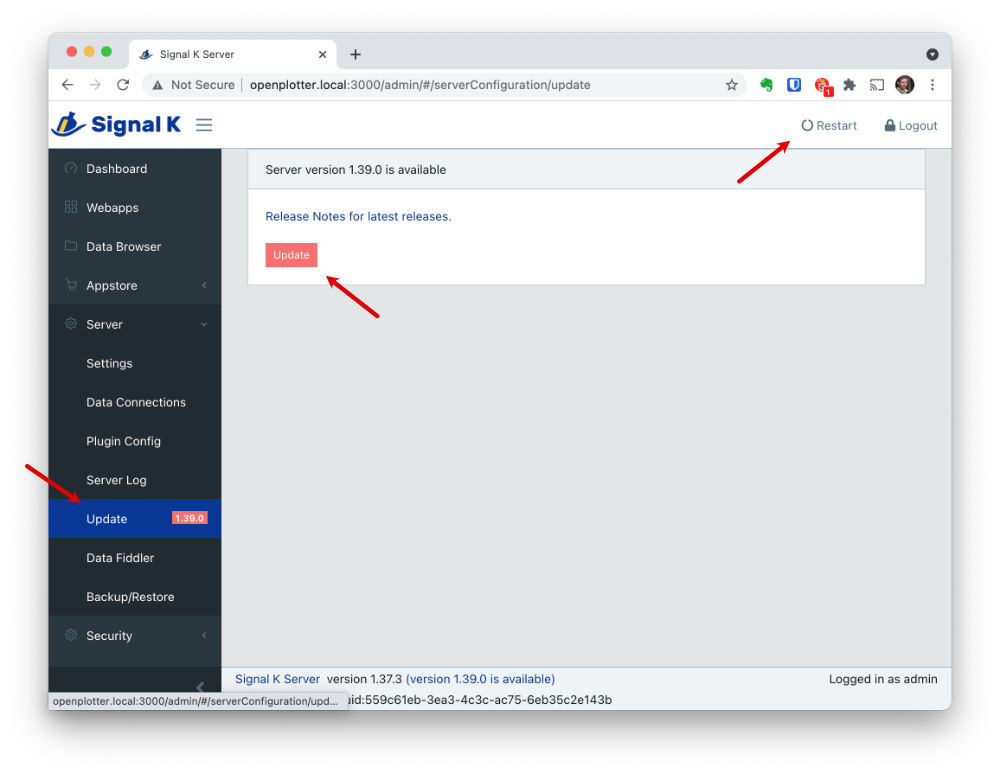{:width="50%"}](assets/screenshots/23_update_server.jpg)

Once you've done that, we can get to business and enable `can0` on the server. Go to Data Connections and click the Add button:

[{:width="50%"}](assets/screenshots/26_data_connections_add.jpg)

Then, configure the connection as follows, and scroll down and click Submit:

[{:width="50%"}](assets/screenshots/28_correct_settings.jpg)

After you've added the data connection, restart the server again. Now, the dashboard should show some connection activity:

[{:width="50%"}](assets/screenshots/30_can0_activity.jpg)

Yay. Time to congratulate yourself. You've come far!

If you want, you can also open the Data Browser at the left hand side menu and see what data you're receiving.

### Creating Instrument Panels

If you're receiving data, you can already visualize it by opening the SK Instrument Panel:

[{:width="50%"}](assets/screenshots/301_sk_plugins.jpg)

You can configure some paths by using the wrench button. The panel sizes and positions can be adjusted by clicking the lock button.

My test lab is just under a metal roof with absolutely now GPS reception, and the only interesting data in my network is coming from the [1-Wire Temperature Sensor](https://hatlabs.github.io/sh-esp32/pages/tutorials/onewire-temperature/). So, my instrument panel now consists of three temperature values:

[{:width="50%"}](assets/screenshots/302_sk_instrument_panel.jpg)

A little bit sad, but exciting at the same time!

In addition to the standard Instrument Panel, there are a lot of very nice dashboard applications for Signal K. You might want to try [KIP](https://github.com/mxtommy/Kip) (found at the SK server app store) or [Wilhelm SK](https://www.wilhelmsk.com/) (for iOS devices only, available at the App Store).

### Installing InfluxDB and Grafana

In the final steps of this tutorial, we install and configure InfluxDB and Grafana to create a historical log and visualizations of the boat data. It's a few more steps and some busy-looking screens, but well worth the small effort!

InfluxDB is a time-series database that we'll use for storing the data. Grafana is a visualization toolkit often used for visualizing IT system health, but due to its versatility, can be used for our marine data visualization purposes as well.

To install InfluxDB and Grafana, go back to VNC Viewer and open OpenPlotter -> Dashboards from the Raspberry menu:

[{:width="50%"}](assets/screenshots/31_openplotter_dashboards.jpg)

Select InfluxDB and click Install. It'll take a while but once it's finished, go back to the Apps tab and select Grafana and click Install. That's it.

[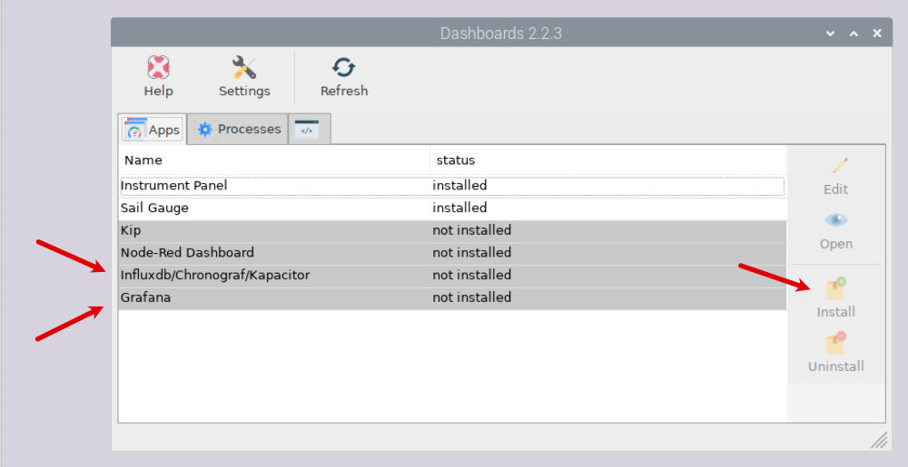{:width="50%"}](assets/screenshots/32_install.jpg)

Then we'll have to create a new database in InfluxDB. Open Chronograf, an InfluxDB web UI in your browser: [http://openplotter.local:8889/](http://openplotter.local:8889/).

[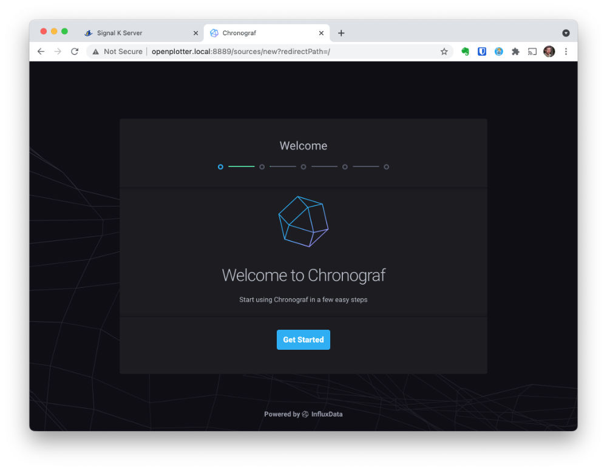{:width="50%"}](assets/screenshots/34_open_chronograf.jpg)

Click through the initial configuration. The Chronograf InfluxDB connection uses username `admin`, password `admin`. You can skip dashboard creation and Kapacitor configuration.

Next, create the new database using the InfluxDB Admin screen:

[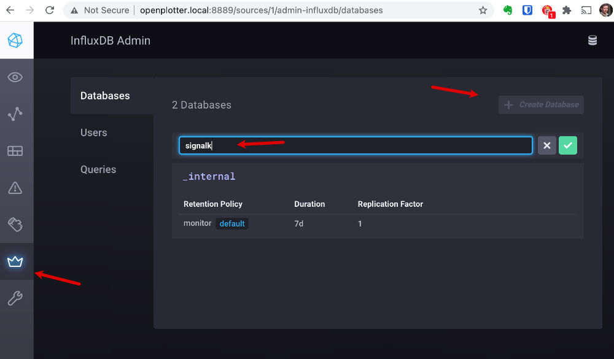{:width="50%"}](assets/screenshots/37_create_signalk_db.jpg)

Give the database name `signalk`, otherwise just click through. Done.

Now that we have the database waiting for us, let's feed some data to it. Go back to the Signal K dashboard to configure the InfluxDB writer plugin:

[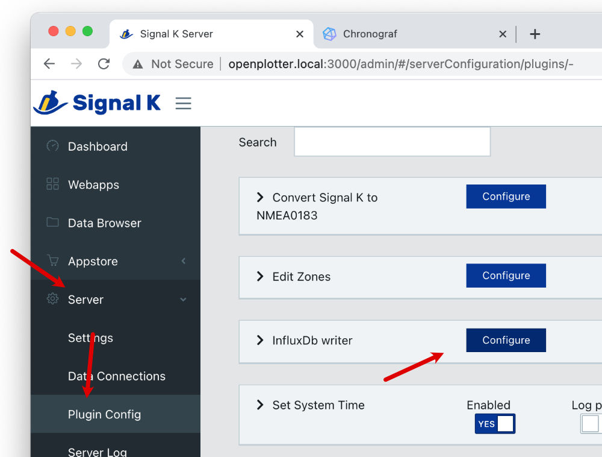{:width="50%"}](assets/screenshots/39_sk_plugin_config.jpg)

Leave the username and password empty. Our database was `signalk`. If you want, modify the batch write interval and data resolution. The interval is 10 seconds by default, but if you want a bit more real-time display of data, enter 2. Resolution dictates how often a single measurement is written to the DB. The default of 200 ms is probably fine but I wanted even more and chose 100 ms. Also select the checkboxes as shown below.

[{:width="50%"}](assets/screenshots/40_settings.jpg)

Scroll down and click Submit to apply the configuration. At this point, we should have measurements flowing into the database. Let's verify that. Go back to Chronograf, select the Explore view. You should have a source called `signalk.autogen` at the bottom. Select that, and individual measurement names should appear. Great.

[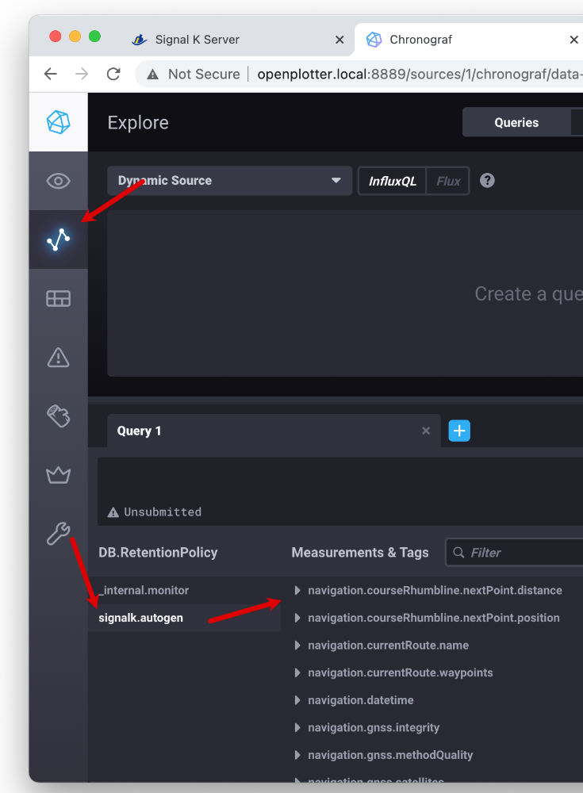{:width="50%"}](assets/screenshots/41_verify_data.jpg)

The only thing that remains is to visualize the historical data. 

### Creating a sample Grafana dashboard

We'll use Grafana to show some fancy graphs. Open Grafana in your browser: [http://openplotter.local:3001](http://openplotter.local:3001).

[{:width="50%"}](assets/screenshots/42_open_grafana.jpg)

Grafana requires a new password to be entered, so do that. Once you get to the home screen, configure the InfluxDB data source:

[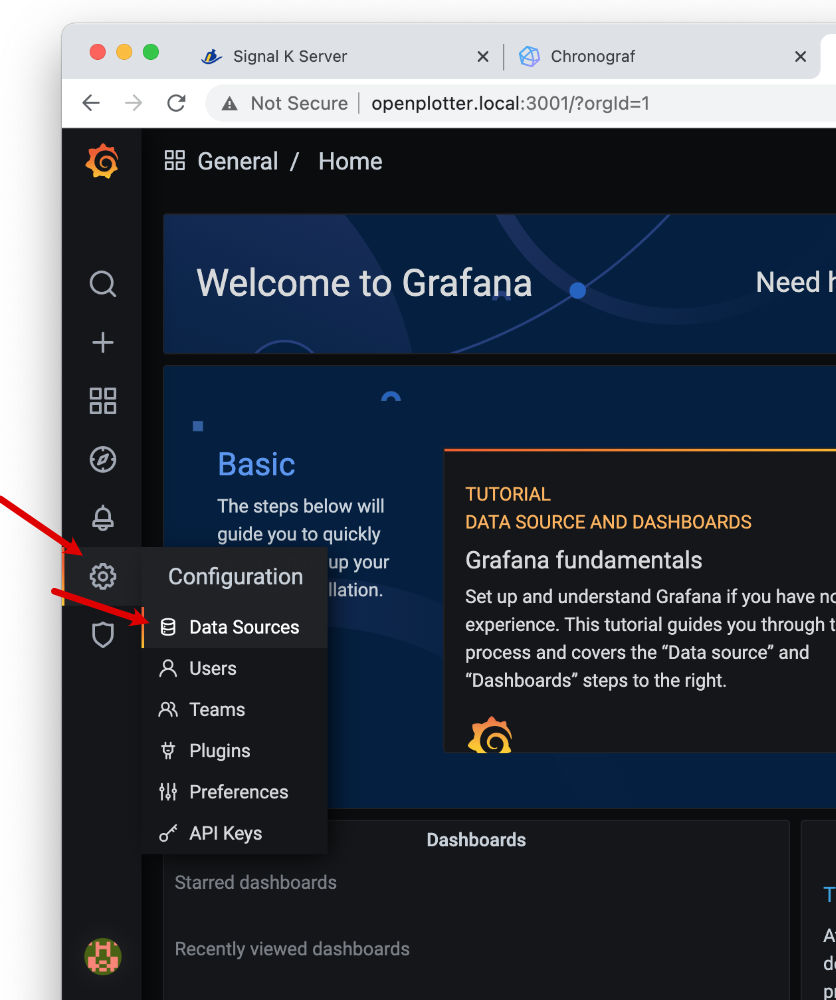{:width="50%"}](assets/screenshots/44_grafana_data_sources.jpg)

In the configuration, the default URL is shown in dark grey but I found I had to explicitly type it in. Other than that, it's again the same `signalk` database and empty user and password. Click "Save and Test" to verify that your data source works. 

[{:width="50%"}](assets/screenshots/46_config_data_source.jpg)

At this point, let's recap what we have. We have Signal K receiving the data from NMEA 2000, we have InfluxDB to store that data, and we have connected Grafana to InfluxDB. Finally, we can create a Grafana dashboard and add new data panels.

The panel editor is a bit busy, but the basic steps are straightforward.

[{:width="50%"}](assets/screenshots/54_panel_title.jpg)

Edit the query. First, select a measurement in the FROM row. Second, you have to add a math modifier to convert the measurement units (Grafana isn't really unit-aware, so by default it always displays the data in the SI units they're stored in). For example, to get to °C from Kelvin you need to subtract -273.15. Or to get from m/s to kn, multiply by 3600 and divide by 1852.

Finish the panel by giving it a title and applying the changes.

You should now have a single panel with a little bit of time data visible in your dashboard. Add a couple of more panels by clicking the Add Panel button. You can position and resize the panels by dragging their titles and corners. Finally, you can select a suitable time range from the top bar and save the dashboard.

This is what my resulting engine temperature dashboard looks like:

[{:width="50%"}](assets/screenshots/56_two_more_panels.jpg)

That's it. Go create awesome dashboards and show them to your marina and yacht club buddies! Also share them at [Hat Labs Discussion forum](https://github.com/hatlabs/discussions/discussions) for inspiration!
